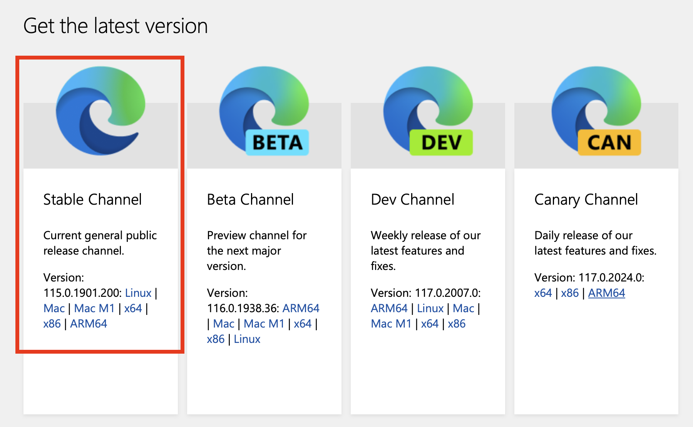
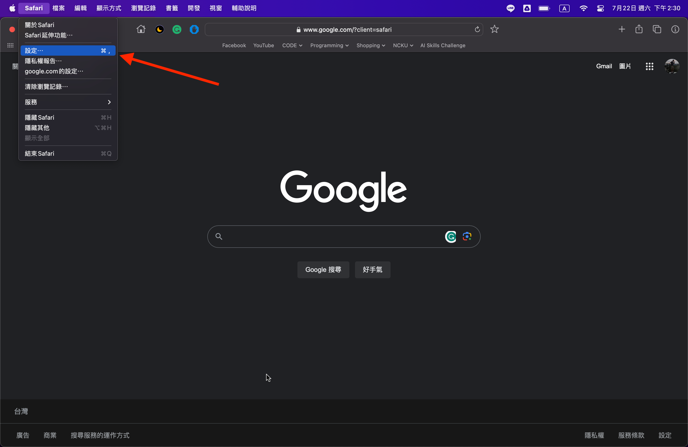
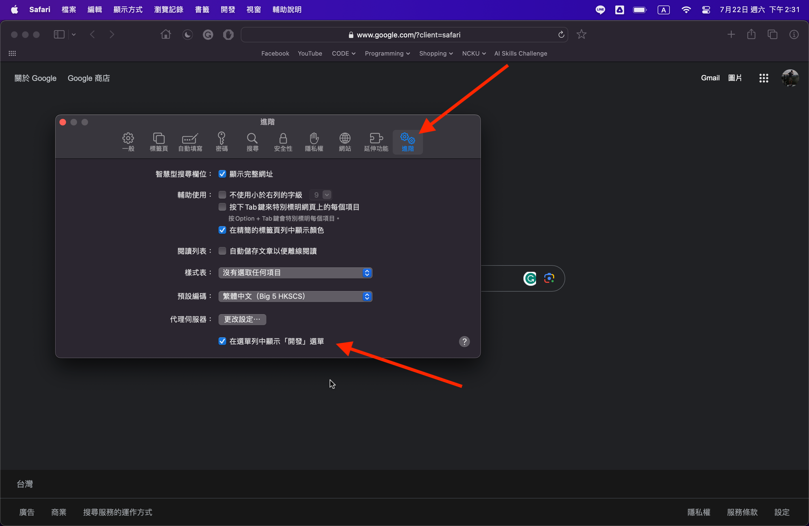
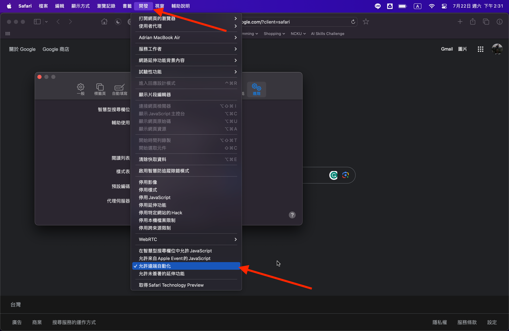

# Batch Code Checker

This repo is designed for checking(tracking) the production date of cosmetics products

## Installation
Clone the repository to your local machine or download the zip file.
```bash
git clone https://github.com/LittleFish-Coder/batch-code-checker.git
```

## Packages
The packages are listed in the requirements.txt file: 
- pandas==2.0.2
- selenium==4.10.0
- openpyxl==3.1.2
- jinja2==3.1.2
- unidecode==1.3.6

Use the package manager [pip](https://pip.pypa.io/en/stable/) to install the packages.
```bash
pip install -r requirements.txt
```
Or use pip3 depending on your python version
```bash
pip3 install -r requirements.txt
```

## Preqrequisites
Make sure you have already downloaded the webdriver before you use the program.

In this program, I use Safari and Edge as an example.
You can use other webdrivers as well.

There are 4 different webdrivers to select:
- [Chrome](https://chromedriver.chromium.org/downloads)
- [Edge](https://developer.microsoft.com/en-us/microsoft-edge/tools/webdriver/)
- [Firefox](https://github.com/mozilla/geckodriver/releases)
- [Safari](https://webkit.org/blog/6900/webdriver-support-in-safari-10/)

Follow the instruction to download the webdriver and read the documentation based on your chosen webdriver.

## Preparation

Prepare `批號日期.xlsx` file in the same directory as the `main.py` file.
And make sure the columns contain the following information:
- 品牌
- 批號

## Usage

- [Edge](#edge) (Recommended)
- [Safari](#safari)

### Edge

Before using the program, make sure you have already downloaded the [Edge Browser](https://www.microsoft.com/zh-tw/edge/download?form=MA13FJ) and the corresponding [webdriver](https://developer.microsoft.com/en-us/microsoft-edge/tools/webdriver/).

When downloading the webdriver, make sure you choose the stable version of the webdriver.


After downloading the webdriver, you should put the webdriver into your PATH.

In macOS, you can put the webdriver into `/usr/local/bin` directory.
- open the Finder
- press `command + shift + g`
- type `/usr/local/bin` and press `enter` (if /usr/local/bin doesn't exist, create one)
- put the webdriver into the `/usr/local/bin` directory


### Safari

Before using the program, make sure you turn on the remote automation in Safari.

To Enable Remote Automation in Safari:
- Open Safari
- Go to Safari > Preferences > Advanced
- Check "Show Develop menu in menu bar"
- Go to Develop > Allow Remote Automation





### Result
If you have done the above steps, you can run the program directly.

```bash
python main.py
```

After the program is finished, you will see the `products_with_date_of_manufacture.xlsx` file in the same directory.